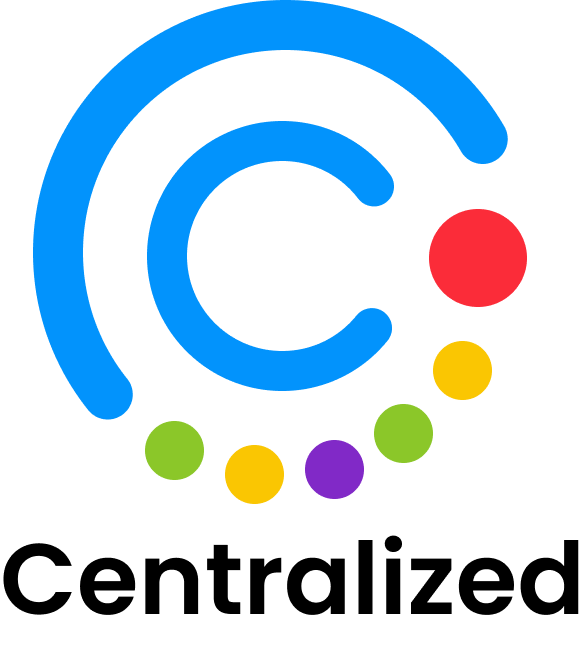
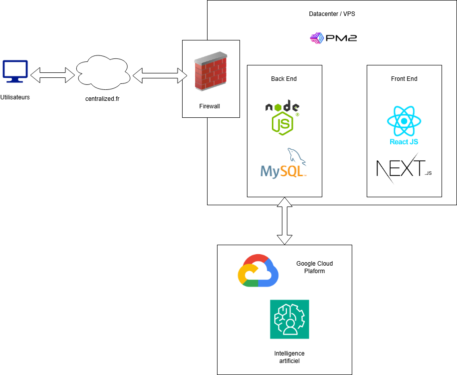
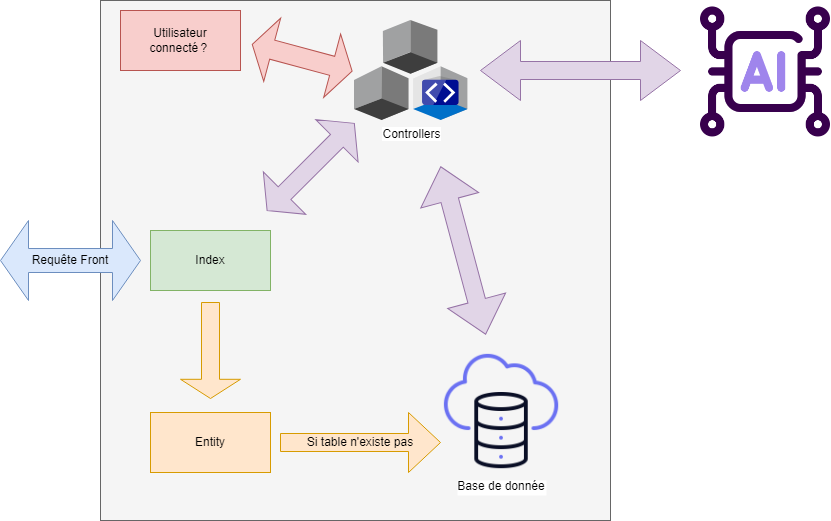
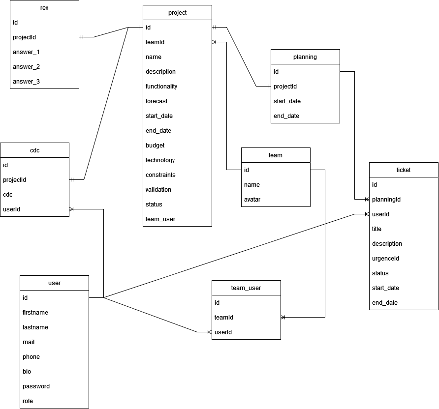

Centralized - Documentation technique  


# Documentation technique

Centralized - GPE 2023-2024



## Information

| Nom du projet | Centralized |
| ---: | :--- |
| Type de document | Documentation technique |
| Date | 16/01/2024 |
| Version | 1.0 |
| Mots-clés |  |
| Auteurs | Paul GILLET (gillet_p), Mathieu BEURET (beuret_m) |

## Rédaction et Modifications

| Version | Date | Nom | Description |
| :---: | :---: | :---: | :---: |
| 1.0 | 16/01/2024 | Paul GILLET | Première version |
| 1.1 | 31/05/2024 | Mathieu BEURET | Révision des procédures |

## Table des matières

- [Documentation technique](#documentation-technique)
  - [Information](#information)
  - [Rédaction et Modifications](#rédaction-et-modifications)
  - [Table des matières](#table-des-matières)
- [Résumé du document](#résumé-du-document)
- [Rappel du fonctionnement de l'application](#rappel-du-fonctionnement-de-lapplication)
  - [Description du projet](#description-du-projet)
  - [Lancement du projet](#lancement-du-projet)
  - [Décomposition du projet](#décomposition-du-projet)
  - [Architecture globale](#architecture-globale)
- [Front](#front)
  - [Technologies utilisées](#technologies-utilisées)
  - [Approche par composants](#approche-par-composants)
  - [Structure de l'application](#structure-de-lapplication)
  - [Tests automatisés](#tests-automatisés)
- [Back](#back)
  - [Architecture](#architecture)
  - [Technologies](#technologies)
  - [Modèle de données](#modèle-de-données)
  - [Interaction extérieure](#interaction-extérieure)
  - [Tests unitaires](#tests-unitaires)
  - [API Privée](#api-privée)
  - [API Publique](#api-publique)
- [Bugs Connus](#bugs-connus)
- [Annexes](#annexes)
  - [Table des illustrations](#table-des-illustrations)

# Résumé du document

Ce document est la documentation technique officielle de l'outil Centralized. Il est divisé en 3 parties :

- La documentation technique du Front: l'application web ;  
- La documentation technique du Back: API ;
- Les bugs connus de notre outil.

# Rappel du fonctionnement de l'application

## Description du projet

Notre GPE a pour objectif la création d'un outil d'accompagnement des chefs de projet boosté par l'intelligence artificiel: **Centralized**.  
L'idée est de permettre à un chef de projet de créé un cahier des charges avec de l'ia, de lui créer automatiquement un planning avec ses tickets en fonction des informations qu'il a entrées et de lui permettre de conclure son projet avec un REX (retour d'expérience).  
L'outil à une interface web lui permettant d'être ouvert sur n'importe quelle plateforme, avec son design simple et ergonomique, il est conçu pour être utilisé par tout type de chef de projet.

## Lancement du projet

Pour lancer le projet, vous devez vous diriger sur la branche "dev" du GitHub. Une fois que vous aurez cloné le projet et que vous serez sur la branche dev, vous devez suivre les commandes suivantes pour lancer le projet:

/!\ Attention, il est nécessaire d'avoir un serveur Mysql, Node.js et npm ou yarn d'installé sur votre machine pour lancer le projet

Nous documentons ici le lancement du projet en local avec yarn ou npm. Pensez à toujour utiliser le même gestionnaire de paquet une fois que vous avez choisi entre yarn et npm.
Nous partons du principes que vous avez déjà cloné le projet et que vous êtes à la racine du projet pour chaque commande.
/!\ Nous partons également du principe que vous avez déjà récupéré les variables d'environnement et que vous avez créé une base de donnée avec le nom correspondant dans le fichier .env

Pour installer les dépendances:

- `cd Front/` ou `cd Back/`
- `npm install` ou `yarn install`

Pour lancer le Front:

- `cd Front/`
- `npm run dev` ou `yarn dev`

Pour lancer le Back:

- `cd Back/`
- `npm run dev` ou `yarn dev`

## Décomposition du projet

à remplir si application mobile et/ou logiciel

## Architecture globale



# Front

## Technologies utilisées

Le front est développé sur une base TypeScript avec NextJS. Il repose sur les dépendances suivantes:

- emotion/react (11.11.1)
- emotion/styled (11.11.0)
- fortawesome/fontawesome-svg-core (6.5.1)
- fortawesome/free-brands-svg-icons (6.5.1)
- fortawesome/free-regular-svg-icons (6.5.1)
- fortawesome/free-solid-svg-icons (6.5.1)
- fortawesome/react-fontawesome (0.2.0)
- fullcalendar/core (6.1.10)
- fullcalendar/daygrid (6.1.10)
- fullcalendar/react (6.1.10)
- mui/icons-material (5.15.0)
- mui/material (5.15.0)
- mui/styled-engine-sc (6.0.0-alpha.8)
- mui/system (5.15.0)
- mui/x-charts (6.18.3)
- mui/x-date-pickers-pro (6.18.5)
- mui/x-date-pickers (6.18.5)
- svgr/cli (8.1.0)
- types/globalize (1.5.5)
- types/node (20.10.4)
- types/react-big-calendar (1.8.8)
- types/react-dom (18.2.17)
- types/react (18.2.45)
- axios (1.6.7)
- babel-plugin-macros (3.1.0)
- date-fns (2.30.0)
- dayjs (1.11.10)
- eslint-config-next (14.0.3)
- eslint (8.55.0)
- jwt-decode (4.0.0)
- next (14.0.3)
- nextjs-tui-date-picker (2.2.1)
- prettier (3.2.4)
- react-big-calendar (1.8.6)
- react-calendar (4.7.0)
- react-dom (18.2.0)
- react-router-dom (6.21.0)
- react (18.2.0)
- sass (1.69.5)
- styled-components (6.1.1)
- swiper (11.0.5)
- typescript (5.3.3)

En raison de la méthode de référencement Google, nous avons décidé d'utiliser NextsJS.
Ce dernier est une surcouche de React, qui corrige le souci de SEO inhérent à React.
Afin d'harmoniser le design de notre application et d'en simplifier le développement, nous avons choisi d'utiliser Material UI,  une bibliothèque de composants React qui implémente les spécifications de Material Design, ainsi que plusieurs composants et bibliothèque d'icones très utiles et en phase avec les derniers standarts graphiques.

## Approche par composants

Avec React, nous avons adopté une approche par composants pour structurer notre application. Chaque composant est une unité autonome qui encapsule une partie de l'interface utilisateur et de la logique associée. Cette approche permet de décomposer l'application en éléments modulaires, ce qui facilite la réutilisation, la maintenance et l'évolutivité du code. Les composants peuvent être imbriqués les uns dans les autres pour former des structures complexes, tout en conservant une structure claire et organisée.
Ils sont également compatibles avec les hooks, qui permettent de gérer l'état et le cycle de vie des composants de manière plus flexible et intuitive.
Chaque composant est un dossier composé d'au maximum 4 fichiers:

- un index.tsx, qui contient le rendu graphique et le minimum de logique du composant
- un style.ts, qui contient le style du composant
- un type.ts, qui contient les types du composant
- un hook.ts, qui contient la majorité voir la totalité de la logique du composant

Ceci nous permet de séparer les différentes parties d'un même composant sans pour autant mélanger les fichiers.

## Structure de l'application

Le front est structuré de la manière suivante:

- Un acceuil, où nous pourrons visualiser les différents projets, les derniers tickets créés, les équipes, les derniers cahiers des charges générés, les plannings et le dernier retour d'expérience
- Une page cahier des charges, dans laquelle nous pourrons créer et visualiser nos cahiers des charges. Nous pourrons également les éditer au travers d'un éditeur de texte riche
- Une page planning, où nous allons afficher les différents planning de nos projets, ainsi que les tickets associés
- Une page retour d'expérience où nous pourrons cloturer nos projets avec un retour d'expérience sur celui-ci, exploitable par l'ia pour améliorer les prochains cahiers des charges
- Une page équipe, où nous pourrons créer, visualiser et éditer nos équipes
- Une page ticket où nous pourrons créer, visualiser et éditer nos tickets
- Une page de compte, pour éditer nos informations personnelles et notre image de profil
- Une page qui gère l'inscription et la connexion des utilisateurs

## Tests automatisés

Nos tests automatisés sont réalisés avec Cypress, ceci afin de faciliter l'intégration de tests automatisés pour notre application web. Cypress est un outil de test end-to-end qui permet de simuler des interactions utilisateur et de vérifier le bon fonctionnement de l'application.
Il offre une interface simple et intuitive pour écrire des tests, ainsi qu'une variété d'outils pour faciliter le débogage et l'analyse des résultats.
Cypress inclut également des fonctionnalités avancées telles que le test de composant, la prise de captures d'écran, l'enregistrement de vidéos et la génération de rapports détaillés, ce qui en fait un outil complet pour la mise en place d'une stratégie de test automatisé.

Nous allons tester chacune des pages et leurs fonctionnalités, afin de nous assurer que l'application fonctionne correctement et que les utilisateurs peuvent interagir avec elle de manière fluide et intuitive.
Ainsi nous pourrons par exemple tester l'upload d'une image, la modification d'un cahier des charges, la suppression d'un tickets...
L'avantage est que nous pouvons capurer l'ensemble des appels API et ainsi ne pas interférer avec la base de donnée. En revanche, cela nous imposes de faire en sorte que les données utilisées pour les tests soient dans le même format que les différents modèles de données utilisés en base.

Les tests ne sont disponibles qu'en environnement de développement, et ne sont pas déployés en production.

/!\ Afin d'éxécuter vos tests, vous devrez lancer le front avant de lancer les tests.
Pour accéder à l'interface graphiques des tests, il suffit de lancer la commande suivante:
`yarn cy:open` ou `npm run cy:open`

Pour exécuter tous les tests en mode headless, il suffit de lancer la commande suivante:
`yarn cy:all` ou `npm run cy:all`

# Back

## Architecture



Lorsque le front fait une requête à l'API autre qu'une requête de connexion, l'api vérifie que l'utilisateur est bien connecté. Si ça n'est pas le cas, alors il aura une erreur.  
Les controllers sont faits de la manière suivante:  

- CdcController
- PlanningController
- ProjectController
- RexController
- TeamController
- TicketController
- UserController

Chaque controller envoie des routes associées à la table du même nom généralement.  
Les Entity permettent la création des tables ou la modification de celle-ci. On crée une entité par table. Elles sont donc faites de la manière suivante:  

- Cdc
- Planning
- Project
- Rex
- Team
- TeamUser
- Ticket
- User

## Technologies

Le back est développé avec Node.js avec TypeScript. Il repose sur les dépendances suivantes:

- axios (1.6.2)
- bcrypt (5.1.0)
- body-parser (1.20.2)
- cors (2.8.5)
- crypto (1.0.1)
- express (4.18.2)
- express-session (1.17.3)
- fs (0.0.1-security)
- jsonwebtoken (9.0.0)
- morgan (1.10.0)
- mysql2 (2.3.3)
- nodemailer (6.9.7)
- openai (4.13.0)
- path (0.12.7)
- reflect-metadata (0.1.13)
- routing-controllers (0.10.4)
- short-uuid (4.2.2)
- ts-node (10.9.1)
- typeorm (0.3.11)

Node.js a été sélectionné en raison de ses caractéristiques d'évolutivité remarquables. Sa capacité à gérer efficacement un grand nombre de connexions simultanées en fait un choix idéal pour les applications nécessitant une extensibilité horizontale.

Le choix d'intégrer TypeScript s'explique par son typage statique, une fonctionnalité qui apporte une valeur ajoutée considérable au développement. La détection précoce des erreurs pendant la phase de développement contribue à renforcer la robustesse du code, tout en facilitant la collaboration au sein de l'équipe. Les fonctionnalités de TypeScript, telles que les modules, les interfaces et les classes, facilitent également la gestion du code à grande échelle, améliorant ainsi la lisibilité et la maintenabilité du projet.

En ce qui concerne TypeORM, le choix a été motivé par plusieurs facteurs. Tout d'abord, la compatibilité native avec TypeScript offre une intégration fluide, permettant de bénéficier des avantages du typage statique tout en travaillant avec une couche d'accès aux données. De plus, l'utilisation d'un ORM simplifie la manipulation des données de la base de données en utilisant des objets plutôt que des requêtes SQL directes. Cela améliore la lisibilité du code et réduit le risque d'erreurs.

Un autre aspect à considérer est l'écosystème robuste soutenant ces technologies. Node.js, TypeScript et TypeORM bénéficient tous de communautés actives, garantissant un accès facile à des ressources, des bibliothèques et des solutions à des problèmes spécifiques. Ce choix est guidé par la recherche d'une solution performante, évolutive et simple à maintenir, alignée sur les tendances actuelles du développement web.

## Modèle de données



## Interaction extérieure

Par manque de temps et de moyen, nous utiliserons ici l'api d'open ai pour la requête ia que nous faisons, et nous passons par mistral AI pour l'ia de backup. Nous passerons par axios pour faire cette requête.  
Notre requête est faite comme ça:

```ts
const data = {
  model: process.env.IA_MODEL,
  messages: [{ role: "user", content: content }],
  temperature: 0,
};

//On prépare la configuration avec la clef d'api openia et le type
const config = {
  headers: {
    "Content-Type": "application/json",
    Authorization: `Bearer ${process.env.API_KEY}`,
  },
};

//on definie le model de backup et le message à l'ia
const databackup = {
  model: process.env.BACKUP_IA_MODEL,
  messages: [{ role: "user", content: content }],
  temperature: 0,
};

//On prépare la configuration avec la clef d'api backup et le type
const configbackup = {
  headers: {
    "Content-Type": "application/json",
    Authorization: `Bearer ${process.env.BACKUP_API_KEY}`,
  },
};

// Requete axios a l'api open ai
console.log("requete ia");
axios
  .post(process.env.IA_URL, data, config)
  .then((response) => {
    cdc = response.data.choices[0].message.content;
    cdc = cdc.replace(/```html/g, "")
    cdc = cdc.split("```")[0]
    console.log(cdc)
    cdc_input.setCdc(cdc);
    cdc_input.setProject(project_input);
    this.cdcRepository.save(cdc_input);
    console.log(`Cahier des charges créé`);
    return cdc;
  })
  .catch(async (error) => {
    console.error("Error:", error);
    // If the first request fails, try a backup URL
    console.log("Backup request ia");
    try {
      const backupResponse = await axios.post(
        process.env.BACKUP_IA_URL,
        databackup,
        configbackup
      );
      cdc = backupResponse.data.choices[0].message.content;
      cdc = cdc.replace(/```html/g, "")
      cdc = cdc.split("```")[0]
      console.log(cdc)
      cdc_input.setCdc(cdc);
      cdc_input.setProject(project_input);
      this.cdcRepository.save(cdc_input);
      console.log(`Cahier des charges créé (backup)`);
      return cdc;
    } catch (backupError) {
      console.error("Backup Error:", backupError);
      // Handle the backup error appropriately (e.g., throw, log, or return a default value).
    }
  });

```

La variable `content` contient le prompt qu'on envoie à l'ia. On lui fournit toutes les informations que l'utilisateurs nous demande ainsi qu'un plan pour la génération du cahier des charges.
Nous fournissons la clef d'autorisation `procsess.env.API_KEY` dans un fichier .env pour sécuriser notre code.  

Une fois la requete fait à l'API, nous enverrons le retour que nous fait l'ia directement dans la base de donnée.

## Tests unitaires

Nous utilisons Jest pour réaliser les tests unitaires sur notre API car c'est le framework le plus documenté et largement utilisé dans la communauté JavaScript. Jest bénéficie d'une documentation complète et détaillée, ce qui facilite son apprentissage et sa mise en œuvre pour les développeurs. Sa popularité au sein de la communauté JavaScript garantit un support étendu, des ressources abondantes et une facilité à trouver des solutions aux problèmes rencontrés. En utilisant Jest, nous pouvons tirer pleinement parti de son expertise documentée pour assurer la qualité et la fiabilité de notre API à travers des tests unitaires complets et bien documentés.

## API Privée

L'api que nous avons créé permet au front de récupérer les informations dont il a besoin. Cette API est privée et uniquement accessible par un utilisateur authentifié.
C'est une API Restfull utilisant Json comme format de données.  

Voici la liste des actions possibles, avec leurs URL Restfull, avec leurs méthodes de requête HTTP ainsi que leur body :

| URL | Méthodes | Body |
| :--- | :--- | :--- |
| /api/register | POST | { "lastname": string, "firstname": string, "mail": string, "password": string }|
| /api/login | POST | { "mail", "password" } |
| /api/user/:id | GET PATCH DELETE | { "lastname": string, "firstname": string, "mail": string, "password": string }|
| /api/requestResetPassword | POST | { "lastname": string, "firstname": string, "mail": string, "password": string }|
| /api/resetPassword | PATCH ||
| /api/team | POST | { "name": string }|
| /api/teamuser | POST | { "team_id": string, "user_id": string }|
| /api/teamuser/:id | GET DELETE ||
| /api/team/:id | GET PATCH DELETE | { "name": string }|
| /api/project/:teamid/:userid | POST | { "name": string, "description": string, "functionality": string, "forecast": string, "start_date": date, "end_date": date, "budget": string, "technology": string, "constraints": string, "validation": string, "team_user": string}|
| /api/project/:id | GET PATCH DELETE | { "name": string, "description": string, "functionality": string, "forecast": string, "start_date": date, "end_date": date, "budget": string, "technology": string, "constraints": string, "validation": string, "team_user": string}|
| /api/project/user/:userid | GET ||
| /api/cdc/:id | GET PATCH DELETE | { "cdc": string }|
| /api/cdc/user/:userid | GET ||
| /api/cdc/project/:projectid | GET ||
| /api/planning | POST | { "project_id": string, "start_date": date, "end_date": date }|
| /api/planning/:id | GET PATCH DELETE | { "start_date": date, "end_date": date }|
| /api/planning/project/:projectid | GET ||
| /api/ticket | POST | { "start_date": date, "end_date": date, "planning_id", string, "user_id": string, "title": string }|
| /api/ticket/:id | GET PATCH DELETE | { "start_date": date, "end_date": date, "planning_id", string, "user_id": string, "title": string }|
| /api/ticket/planning/:planningid | GET ||
| /api/ticket/user/:userid | GET ||
| /api/rex | POST | { "answer1": string, "answer2": string, "answer3": string, "project": string}|
| /api/rex/:id | GET PATCH DELETE | { "answer1": string, "answer2": string, "answer3": string, "project": string}|
| /api/rex/project/:projectid | GET ||

## API Publique

Cette API est pour l'instant inexistante.

# Bugs Connus

inconnu

# Annexes

## Table des illustrations

Illustration 1: [Architecture Global](#architecture-globale)  
Illustration 2: [Front - Architecture](#architecture)  
Illustration 3: [Back - Architecture](#architecture-1)  
Illustration 4: [Back - Modèle de données](#modèle-de-données)  
